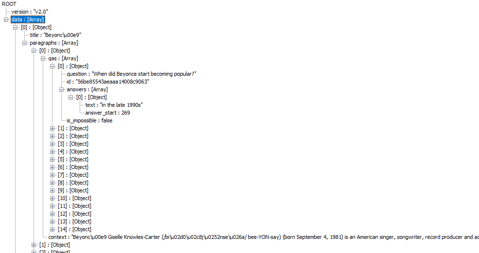
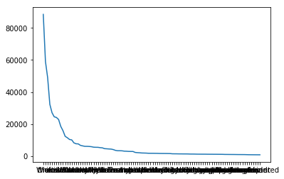

# retrieval-based-question-answering-system   
### 概要

实现基于检索的简易问答系统。

既然是基于检索的系统，那么系统的重点就在于<问题，答案>的知识库，在这个库中搜索用户输入问题最相似的问题，返回top K答案即可。

比如，在知识库中存在以下几个<问题，答案>：

<"贪心学院主要做什么方面的业务？”， “他们主要做人工智能方面的教育”>
<“国内有哪些做人工智能教育的公司？”， “贪心学院”>
<"人工智能和机器学习的关系什么？", "其实机器学习是人工智能的一个范畴，很多人工智能的应用要基于机器学习的技术">
<"人工智能最核心的语言是什么？"， ”Python“>....

假设一个用户往系统中输入了问题 “贪心学院是做什么的？”， 系统需要去匹配最相近的“已经存在库里的”问题。 那在这里很显然是 “贪心学院是做什么的”和“贪心学院主要做什么方面的业务？”是最相近的。 所以当我们定位到这个问题之后，直接返回它的答案 “他们主要做人工智能方面的教育”就可以了。 所以这里的核心问题可以归结为计算两个问句（query）之间的相似度。

### 依赖

- python3
- json
- nltk
- math
- numpy

### 运行模型

基于tf-idf的接口是top5results_invidx("Who is White's daughter")，括号中的是问题

基于词向量的接口是top5results_emb("Who is White's daughter")

> \> python test.py
> test tfidf
> question:Who is White's daughter
> ['Coronis', 'Daphne', 'impossible', 'Dr. Madeline Swann', 'impossible']
> test embedded
> question:Who is White's daughter
> ['Dr. Madeline Swann', 'Coronis', 'Daphne', 'Auguste Clésinger.', '17']
> question:which company verify contents of the leaked information
> ['Eon Productions', 'impossible', 'Hans von Herwarth', 'Sony Pictures Entertainment', 'impossible']   

进入test目录，运行test.py即可，该脚本会自动加载问答系统，并对输入的问题和需要检索的方式返回对应的结果，以上对问题”Who is White's daughter“分别使用了tf-idf相似度和embedding相似度的测试，两者返回答案有所重叠，但是排序结果不一样，在问题库中实际答案是“Dr. Madeline Swann”，所以词向量方式的准确率更加精准。

### 实现

#### 1.数据

原始数据以json的方式组织，需要提取它的<问题，答案>对，原始数数据如下：

data下有多个主题，每个主题有多个子主题，每个子主题又有多个<问题，答案>对，所以需要一个三层循环将所有的<问题，答案>对提取出来。其中有部分问题是没有答案，即is_impossible字段是true，这时候将答案标记为impossible，表示没有合适的答案。最终，问题和答案分别放在各自的list中，下标相同的是一对<问题，答案>

#### 2.数据分析

##### 可视化词频统计信息

上图横轴是词，有些看不清但是不影响效果，纵轴是单词出现的总次数，这个图形符合zipf定律，表明只有极少数的词被经常使用

##### 词频top 10 单词

统计问题和回答中的词频top 10 单词，两者共有的单词有“the”，“of”，“in”，“to”，“a”，有些类似中文中的“的”，“了”，“在”等一些助词。而问题独有更多的是what和is，did，这一类用在问题开头的单词，答案独有的其实和前面共有的没有太多区别。很重要的一点是，top10几乎都可以被认为是停用词，对于相似度的匹配没有太大的效果。

['the', 'What', 'of', 'in', 'to', 'was', 'is', 'did', 'what', 'a']
[ 'the', 'of', 'and', 'to', 'a', 'in', 'The', 'or', 'for', 'million']

#### 3.文本预处理

根据前面的分析：

- 第一步是做停用词的过滤；
- 第二步是大小写统一，top10中有What和what，the和The；
- 第三步去掉标点符号；
- 第四步做词频范围的处理，去掉低频词
- 第五步对数字做特殊处理，统一成一个单词#number
- 第六步作词干提取，stemming

#### 4.文本表示

将每个问题表示成td-idf向量，

- 统计每个问题每个单词的出现数，即tf
- 统计每个单词出现的问题数，即idf
- 根据上面两步的计算结果计算tf-idf矩阵

#### 5.问题搜索

- 对于输入问题做和文本预处理一样的预处理和文本表示处理
- 将输入问题和每个做余弦相似度计算，总是保持topk的有序列表
- 最后返回topk的列表

#### 6.优化---倒排表

在第五步中，因为是tf-idf相似度计算，所以如果输入问题和数据库中的某个问题没有一个字是一样的话，计算出来的结果肯定是0，所以可以使用倒排表做一个加速。

- 建立一个以单词为key的dict，value是问题下标；
- 输入一个问题时，先做预处理，做完预处理之后，根据预处理后的每个单词找到倒排表中可能的问题
- 对第二步中搜到的每个问题再做余弦相似度计算，得到topk

#### 7.优化---词向量

通过一些简单的测试可以发现，有些问题的输入可以找到正确答案，但是正确答案不是排在第一位的，因为之前的实现方式很可能出现多个问题的余弦相似度计算结果都为1。

比如对于问题“Who is White's daughter”，得到的top5结果如下：

Who was the daughter of Phlegyas?
Coronis
Who was the daughter of Peneus?
Daphne
Who was the daughter of Hind?
impossible
Who is White's daughter?
Dr. Madeline Swann
What was the name of Minamato's daughter?
impossible

由于之前的一些预处理导致名字因为词频过滤已经被过滤掉了，停用词也被过滤掉，所以计算相似度时只要有who 和daughter的相似度都是1。而且排序时，先计算相似度的总是排在后计算相似度的前面，导致了问题的出现。

因此，有两个问题需要处理，第一个是低频词不可以过滤掉，第二个是tf-idf对于具有相同意思的不同单词和不同意思的不同单词计算结果都是0。所以采用词向量的方式再做一次优化。

词向量文件太大没有上传，在https://nlp.stanford.edu/projects/glove/   可以下载到。

### 结果

词向量方式的检索问答系统精度高于td-idf向量方式的检索问答系统。比如还是问题“Who is White's daughter”；结果如下：

Who is White's daughter?
Dr. Madeline Swann
Who was the daughter of Phlegyas?
Coronis
Who was the daughter of Peneus?
Daphne
Who was the fortune hunter engaged to Sand's daughter?
Auguste Clésinger.
How old was Victoria's oldest daughter when she was amrried?
17

### 总结

本项目实现了一个简单的问答系统，分析了文本的一些特征和不同文本表示方式对于系统表现的差异。同时也使用了倒排表对系统效率做了提升。